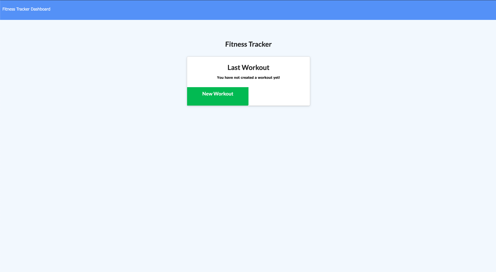
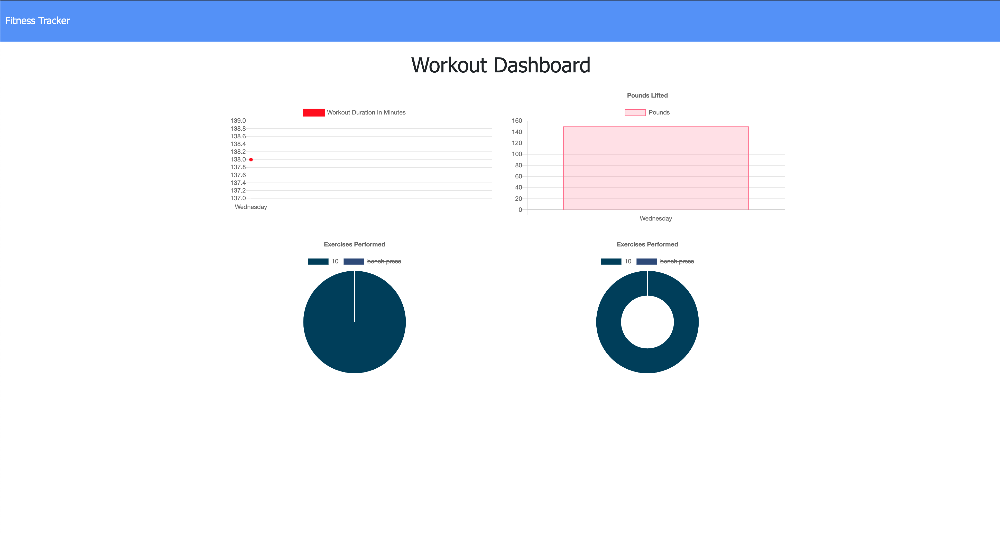
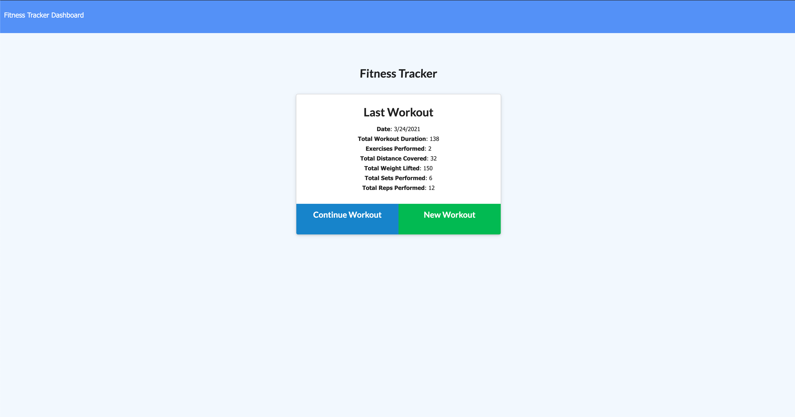

 # Workout Mongoose 

[Workout Mongoose](https://workoutmongoose.herokuapp.com/)

## description

This app was designed for the consumer to reach their fitness goals more quickly when they track their workout progress.The app contains options to create a new workout or continue with their last workout.The user is able to add exercises to the most recent workout plan. add new exercises to a new workout plan. View the combined weight of multiple exercises from the past seven workouts on the stats page. View the total duration of each workout from the past seven workouts on the stats page.

## table of Contents

- [Installation](#installation)
- [User Story](#user)
- [Technology Used](#Technology)
- [Questions](#questions)
- [License](#license)

## installatiom

Run Npm I dependecies or use the direct link provided for the app.

## user Story

As a user, I want to be able to view create and track daily workouts. I want to be able to log multiple exercises in a workout on a given day. I should also be able to track the name, type, weight, sets, reps, and duration of exercise. If the exercise is a cardio exercise, I should be able to track my distance traveled.

## technology Used 
 
* Express
* Mongoose
* MONGO DB 

## questions
 Contact me 
EMAIL: Xferreiramat@gmail.com
## license
Content in this project is governed under the MIT License.

To read the license in its entirety, click here: [MIT](./LICENSE)

---

Copyright [2021] [Mateo Ferreira]
 

